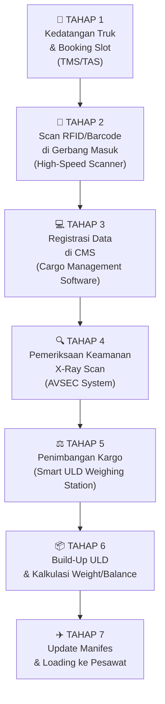

# Simulasi Perpindahan Data — Air Cargo & Intermodal Terminal

## Deskripsi
Membangun sistem web simulasi yang memvisualisasikan **alur perpindahan data** kargo udara, mulai dari kedatangan truk di bandara hingga pemuatan ke pesawat. Sistem ini akan menunjukkan bagaimana data berpindah antar perangkat hardware dan software di setiap tahapan.

---

## Alur Lengkap Perpindahan Data (7 Tahapan)

Alur asli yang Anda sebutkan (scan RFID → X-Ray → Timbang → Muat) sudah benar. Berikut versi lengkapnya dengan tambahan tahapan yang sesuai materi:



### Detail Setiap Tahapan:

| # | Tahapan | Hardware | Software | Data yang Berpindah |
|---|---------|----------|----------|---------------------|
| 1 | **Kedatangan Truk** | — | TMS/TAS | Nomor truk, slot dock, ETA, nomor AWB |
| 2 | **Scan RFID/Barcode** | High-Speed RFID/Barcode Scanner | CMS | SSCC, GTIN, batch, expiry, jumlah koli |
| 3 | **Registrasi di CMS** | — | CMS | AWB number, shipper, consignee, deskripsi barang |
| 4 | **X-Ray Scan (AVSEC)** | X-Ray Scanner | AVSEC System | Status keamanan: CLEARED / SUSPECT |
| 5 | **Penimbangan** | Smart ULD Weighing Station | CMS | Berat aktual kargo (kg) |
| 6 | **Build-Up ULD** | — | CMS + Weight & Balance | Alokasi ULD, posisi kompartemen, total berat |
| 7 | **Update Manifes & Loading** | — | CMS | Manifes penerbangan final, loadsheet |

> [!IMPORTANT]
> **Tambahan dari alur asli Anda:**
> - **Tahap 1 (Kedatangan Truk):** Ditambahkan karena sebelum scan, truk harus diarahkan ke dock yang tepat oleh TMS/TAS.
> - **Tahap 3 (Registrasi CMS):** Ditambahkan karena data hasil scan perlu diregistrasikan dan dicocokkan dengan dokumen AWB.
> - **Tahap 6 (Build-Up ULD):** Dipecah dari penimbangan karena setelah ditimbang, kargo masih harus dialokasikan ke ULD tertentu dan dihitung keseimbangannya.
> - **Tahap 7 (Update Manifes):** Ditambahkan karena sebelum pesawat berangkat, manifes final harus diterbitkan.

---

## Arsitektur Sistem

Sistem akan dibangun sebagai **web application** single-page dengan arsitektur berikut:

```
┌─────────────────────────────────────────────────┐
│                  FRONTEND (HTML/CSS/JS)          │
│                                                  │
│  ┌──────────┐  ┌──────────┐  ┌──────────┐      │
│  │ Dashboard │  │ Simulasi │  │ Database │      │
│  │  Overview │  │  Step-by │  │  Viewer  │      │
│  │           │  │  -Step   │  │          │      │
│  └──────────┘  └──────────┘  └──────────┘      │
│                      │                           │
│              ┌───────┴───────┐                   │
│              │  API Gateway  │                   │
│              │  (Simulated)  │                   │
│              └───────┬───────┘                   │
│                      │                           │
│  ┌─────────────────────────────────────────┐    │
│  │         LOCAL STORAGE / IndexedDB       │    │
│  │  (Simulated Database)                    │    │
│  │                                          │    │
│  │  • cargo_shipments                       │    │
│  │  • uld_containers                        │    │
│  │  • flight_manifests                      │    │
│  │  • security_checks                       │    │
│  │  • weight_records                        │    │
│  │  • scan_logs                             │    │
│  └─────────────────────────────────────────┘    │
└─────────────────────────────────────────────────┘
```

> [!NOTE]
> Karena ini adalah **simulasi PoC**, sistem akan dibuat sebagai **web app standalone** (HTML + CSS + JavaScript murni) tanpa perlu server backend. Database disimulasikan menggunakan **LocalStorage/IndexedDB** di browser. Ini memudahkan untuk presentasi dan demo tanpa perlu setup server.

---

## Fitur yang Akan Dibangun

### Halaman 1: Dashboard Overview
- Statistik real-time: jumlah kargo masuk, kargo diproses, kargo dimuat
- Status pipeline: berapa kargo di setiap tahapan
- Informasi penerbangan aktif

### Halaman 2: Simulasi Step-by-Step (Halaman Utama)
- **Tampilan visual** alur 7 tahapan dengan animasi perpindahan data
- Pada setiap tahapan, user bisa:
  - Melihat **JSON payload** yang dikirim/diterima
  - Melihat **status data** berubah secara real-time
  - Klik tombol untuk melanjutkan ke tahap berikutnya
- Simulasi interaktif:
  - Tahap 1: Input data truk → klik "Daftarkan Truk"
  - Tahap 2: Klik "Scan RFID" → data terisi otomatis
  - Tahap 3: Data terregistrasi di CMS
  - Tahap 4: Klik "X-Ray Scan" → status CLEARED/SUSPECT
  - Tahap 5: Klik "Timbang" → berat tercatat
  - Tahap 6: Klik "Alokasikan ke ULD" → ULD dipilih otomatis
  - Tahap 7: Klik "Finalisasi Manifes" → manifes terbit

### Halaman 3: Database Viewer
- Tampilkan semua tabel database dalam format tabel
- Filter dan pencarian data

---

## Struktur Database (Tabel)

### 1. `truck_arrivals` (Kedatangan Truk)
| Field | Tipe | Deskripsi |
|-------|------|-----------|
| id | string | ID unik kedatangan |
| truck_plate | string | Nomor plat truk |
| driver_name | string | Nama supir |
| dock_slot | string | Nomor dock yang dialokasikan |
| arrival_time | datetime | Waktu kedatangan |
| status | string | ARRIVED / UNLOADING / COMPLETED |

### 2. `cargo_shipments` (Data Kargo)
| Field | Tipe | Deskripsi |
|-------|------|-----------|
| id | string | ID unik kargo |
| awb_number | string | Nomor Air Waybill |
| sscc | string | Serial Shipping Container Code (18 digit) |
| gtin | string | Global Trade Item Number |
| batch_no | string | Nomor batch |
| expiry_date | date | Tanggal kedaluwarsa |
| shipper | string | Nama pengirim |
| consignee | string | Nama penerima |
| description | string | Deskripsi barang |
| quantity | number | Jumlah koli |
| truck_arrival_id | string | FK ke truck_arrivals |
| scan_time | datetime | Waktu scan RFID |
| current_stage | string | Tahapan saat ini (1-7) |
| status | string | SCANNED / SECURITY_CHECK / CLEARED / WEIGHED / ALLOCATED / LOADED |

### 3. `security_checks` (Pemeriksaan AVSEC)
| Field | Tipe | Deskripsi |
|-------|------|-----------|
| id | string | ID unik pemeriksaan |
| cargo_id | string | FK ke cargo_shipments |
| xray_result | string | CLEARED / SUSPECT |
| inspector_id | string | ID petugas inspeksi |
| check_time | datetime | Waktu pemeriksaan |
| notes | string | Catatan (jika SUSPECT) |

### 4. `weight_records` (Data Penimbangan)
| Field | Tipe | Deskripsi |
|-------|------|-----------|
| id | string | ID unik penimbangan |
| cargo_id | string | FK ke cargo_shipments |
| actual_weight_kg | number | Berat aktual (kg) |
| weigh_time | datetime | Waktu penimbangan |
| device_id | string | ID timbangan yang digunakan |

### 5. `uld_containers` (Kontainer ULD)
| Field | Tipe | Deskripsi |
|-------|------|-----------|
| id | string | ID unik ULD |
| uld_code | string | Kode ULD (contoh: AKE-12345-GA) |
| uld_type | string | Tipe ULD (AKE, PMC, PLA, dll) |
| max_weight_kg | number | Kapasitas maks berat (kg) |
| current_weight_kg | number | Berat saat ini (kg) |
| flight_id | string | FK ke flight_manifests |
| compartment | string | Posisi kompartemen di pesawat |
| status | string | EMPTY / LOADING / FULL / LOADED |

### 6. `flight_manifests` (Manifes Penerbangan)
| Field | Tipe | Deskripsi |
|-------|------|-----------|
| id | string | ID unik manifes |
| flight_number | string | Nomor penerbangan (contoh: GA-707) |
| aircraft_type | string | Tipe pesawat (contoh: Boeing 737-800F) |
| destination | string | Tujuan penerbangan |
| departure_time | datetime | Jadwal keberangkatan |
| max_cargo_weight_kg | number | Batas maks berat kargo |
| current_total_weight_kg | number | Total berat kargo saat ini |
| status | string | OPEN / LOADING / CLOSED / DEPARTED |

### 7. `scan_logs` (Log Perpindahan Data)
| Field | Tipe | Deskripsi |
|-------|------|-----------|
| id | string | ID unik log |
| cargo_id | string | FK ke cargo_shipments |
| stage | number | Tahapan (1-7) |
| action | string | Aksi yang dilakukan |
| json_payload | string | Data JSON yang dikirim |
| response | string | Response dari sistem |
| timestamp | datetime | Waktu aksi |

---

## Proposed Changes

### [NEW] `index.html`
File utama HTML dengan struktur 3 halaman (Dashboard, Simulasi, Database Viewer).

### [NEW] `style.css`
Styling premium dengan dark theme, glassmorphism, animasi, dan desain modern.

### [NEW] `app.js`
Logika utama aplikasi: routing, state management, simulasi alur data.

### [NEW] `database.js`
Modul database simulator menggunakan LocalStorage/IndexedDB dengan operasi CRUD.

### [NEW] `simulation.js`
Logika simulasi 7 tahapan perpindahan data, termasuk JSON payload generation.

---

## Verification Plan

### Manual Verification
1. Buka `index.html` di browser
2. Jalankan simulasi dari Tahap 1 sampai Tahap 7
3. Verifikasi bahwa JSON payload di setiap tahapan sesuai dengan standar GS1/SSCC
4. Verifikasi bahwa data tersimpan dengan benar di database viewer
5. Verifikasi tampilan dashboard menampilkan statistik yang akurat
